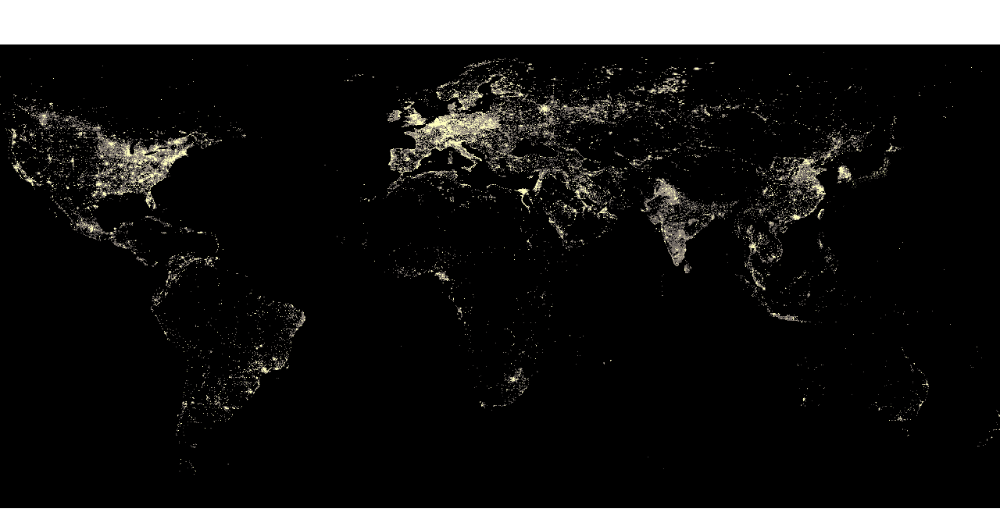

## For the covid19 SpaceAppsChallenge

## SpaceAppsChallenge Official pages
- https://www.spaceappschallenge.org/

## Challenge theme is『An Integrated Assessment』
- https://covid19.spaceappschallenge.org/challenges/covid-challenges/integrated-assessment/details

## Measuring of economic damage caused by COVID-19 using Night Light
#### we are here
- https://covid19.spaceappschallenge.org/challenges/covid-challenges/integrated-assessment/teams/geojackass-1/project

## Summary
It has become clear that the intensity of night light acquired by satellites is correlated with social and economic indicators such as gross domestic product, employment, population, and education in each country. In this project, I first describe the method of calculating the night light intensity in Japan by prefecture and city. Based on the results of the various analyses, we are predicting for economic damage caused by corona using Night Light.

### Released under the MIT license
##### Copyright (c) 2020 Shoichi Otomo [@geojackass](https://twitter.com/geojackass)

- read under the MIT LICENSE  
[Open Source Initiative](http://opensource.org/licenses/mit-license.php)  

Permission is hereby granted, free of charge, to any person obtaining a copy of this software and associated documentation files (the "Software"), to deal in the Software without restriction, including without limitation the rights to use, copy, modify, merge, publish, distribute, sublicense, and/or sell copies of the Software, and to permit persons to whom the Software is furnished to do so, subject to the following conditions:  

The above copyright notice and this permission notice shall be included in all copies or substantial portions of the Software.  

THE SOFTWARE IS PROVIDED "AS IS", WITHOUT WARRANTY OF ANY KIND, EXPRESS OR IMPLIED, INCLUDING BUT NOT LIMITED TO THE WARRANTIES OF MERCHANTABILITY, FITNESS FOR A PARTICULAR PURPOSE AND NONINFRINGEMENT. IN NO EVENT SHALL THE AUTHORS OR COPYRIGHT HOLDERS BE LIABLE FOR ANY CLAIM, DAMAGES OR OTHER LIABILITY, WHETHER IN AN ACTION OF CONTRACT, TORT OR OTHERWISE, ARISING FROM, OUT OF OR IN CONNECTION WITH THE SOFTWARE OR THE USE OR OTHER DEALINGS IN THE SOFTWARE.
